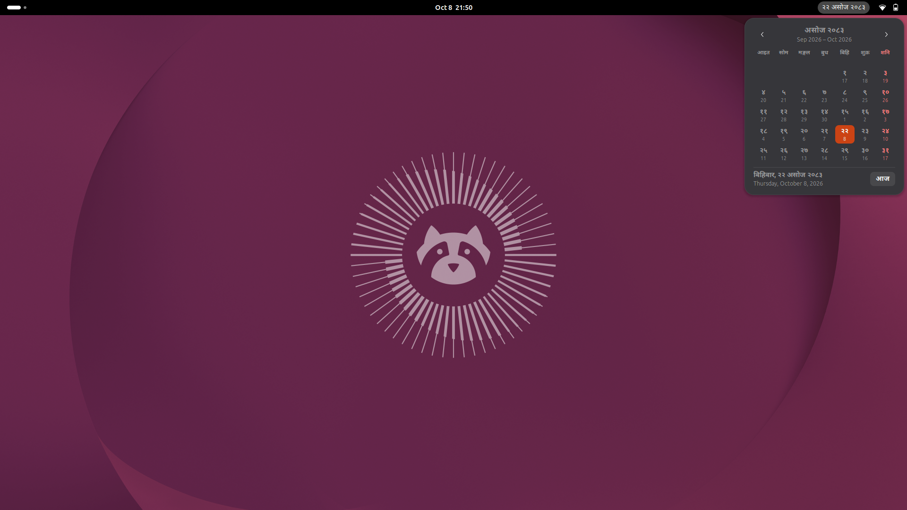
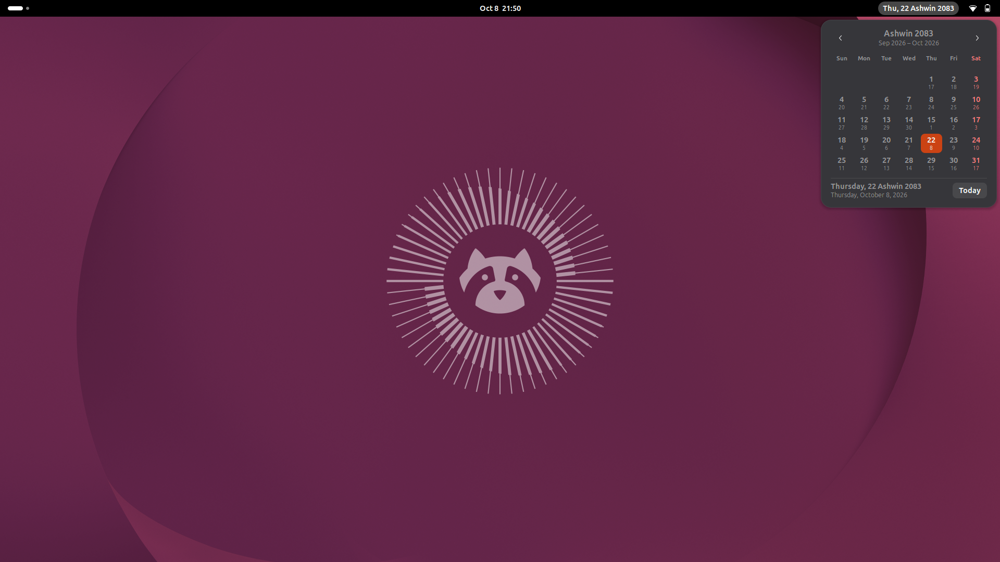
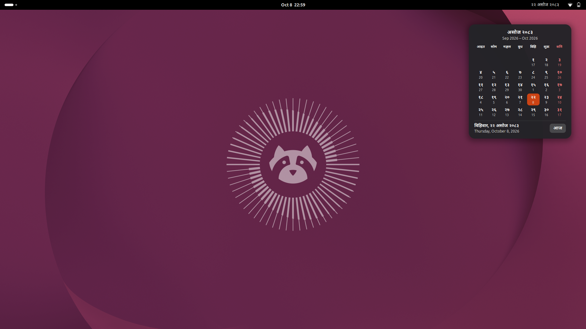
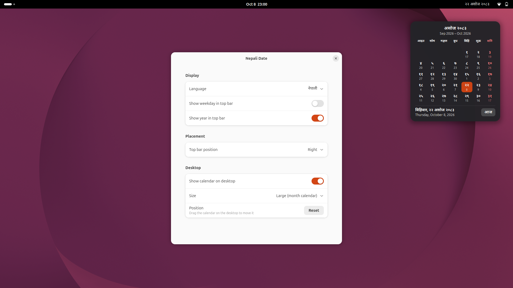

# Nepali Date - GNOME Shell extension

Shows today's Bikram Sambat date in the top bar (e.g. `२२ असोज २०८३`). Click it for a
month calendar with BS days, the matching AD days, Saturdays in red, and month navigation.
The same calendar can also sit on the desktop; drag it anywhere.

- `src/bs.js` - BS⇄AD conversion (1975–2199 BS). Add rows to `MONTH_LENGTHS` as new official calendars are published.
- `src/extension.js` - top-bar indicator and calendar popup.
- `src/calendar.js` - the month calendar, shared by the popup and the desktop.
- `src/desktop.js` - the draggable desktop calendar.
- `src/prefs.js` - settings: language (नेपाली/English), weekday/year in the top bar, position, desktop calendar.

Install: `scripts/install.sh`, log out and back in (Wayland), then `gnome-extensions enable mk-nepali-date@mohankhadka.com.np`.
Settings: `gnome-extensions prefs mk-nepali-date@mohankhadka.com.np`.
Uninstall: `scripts/uninstall.sh` - unloads it from the top bar right away, removes its files and resets its settings.
Build: `scripts/build.sh` - writes `dist/mk-nepali-date.zip` for upload to extensions.gnome.org.
Screenshots: `scripts/screenshots.sh` - regenerates `docs/screenshots/*.png`.

## Screenshots

On the desktop:

Settings:

Regenerate all screenshots with `scripts/screenshots.sh`. It runs a throwaway headless GNOME Shell, so your own session is never touched.
